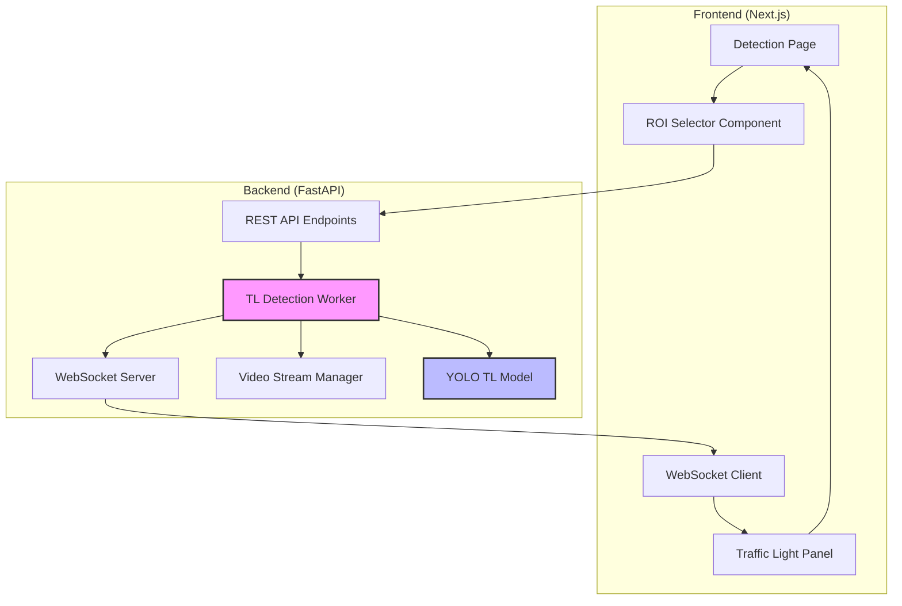
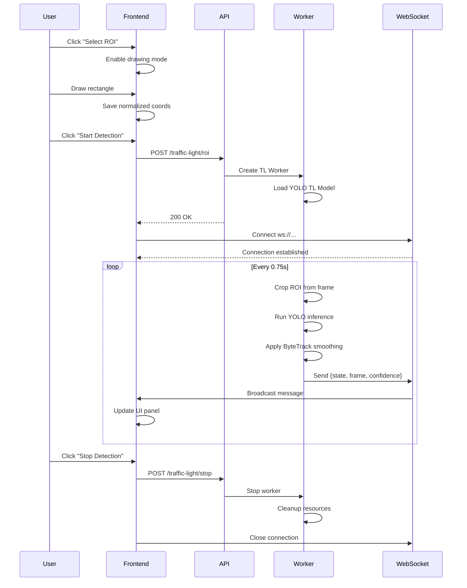

# Design Document - Traffic Light ROI Detection System

## Overview

Traffic Light ROI Detection System là một module bổ sung cho hệ thống phát hiện vi phạm giao thông hiện tại. Module này cho phép người dùng chọn vùng quan tâm (ROI) trên video để phát hiện trạng thái đèn giao thông (xanh/đỏ/vàng) một cách realtime và nhẹ nhàng.

### Key Design Principles

1. **Separation of Concerns**: TL detection hoàn toàn độc lập với vehicle detection
2. **Resource Efficiency**: Chạy với tần suất thấp (~0.75s) để tiết kiệm GPU/CPU
3. **Realtime Feedback**: WebSocket streaming cho trải nghiệm người dùng mượt mà
4. **Graceful Degradation**: Xử lý lỗi và edge cases một cách an toàn

### Technology Stack

- **Frontend**: Next.js 14, React 18, TypeScript, React Bootstrap
- **Backend**: Python 3.10+, FastAPI, asyncio
- **ML Models**: YOLO (ONNX/PyTorch), ByteTrack
- **Communication**: WebSocket (binary + JSON), REST API
- **Video Processing**: OpenCV, NumPy

## Architecture

### System Architecture Diagram



### Component Interaction Flow



## Components and Interfaces

### Frontend Components

#### 1. ROI Selector Component

**Purpose**: Cho phép người dùng vẽ hình chữ nhật trên video để chọn vùng đèn giao thông.

**State Management**:
```typescript
interface ROIState {
  isDrawing: boolean;
  startPoint: { x: number; y: number } | null;
  endPoint: { x: number; y: number } | null;
  selectedROI: NormalizedROI | null;
}

interface NormalizedROI {
  x: number;      // [0, 1]
  y: number;      // [0, 1]
  width: number;  // [0, 1]
  height: number; // [0, 1]
}
```

**Key Methods**:
- `handleMouseDown(event)`: Bắt đầu vẽ ROI
- `handleMouseMove(event)`: Cập nhật preview rectangle
- `handleMouseUp(event)`: Hoàn tất và lưu ROI
- `normalizeCoordinates(x, y, width, height)`: Chuyển pixel coords → normalized [0,1]
- `clearROI()`: Xóa ROI hiện tại

**Rendering**: SVG overlay với `position: absolute` trên video canvas, z-index cao hơn video.

#### 2. Traffic Light Panel Component

**Purpose**: Hiển thị preview ROI và trạng thái đèn giao thông realtime.

**State Management**:
```typescript
interface TrafficLightState {
  state: 'GREEN' | 'RED' | 'YELLOW' | 'UNKNOWN';
  confidence: number;
  timestamp: string;
  framePreview: string; // base64 JPEG
  isDetecting: boolean;
}
```

**UI Layout**:
```
┌─────────────────────────────┐
│  Traffic Light ROI          │
├─────────────────────────────┤
│  [ROI Preview Image]        │
│                             │
│  Status: ● GREEN (95%)      │
│  Last Update: 12:34:56      │
│                             │
│  [Start Detection]          │
│  [Stop Detection]           │
└─────────────────────────────┘
```

**Responsive Behavior**:
- Desktop (≥768px): Panel bên phải video (flex-row)
- Mobile (<768px): Panel dưới video (flex-column)

#### 3. WebSocket Client Manager

**Purpose**: Quản lý kết nối WebSocket và xử lý messages từ backend.

**Interface**:
```typescript
class TrafficLightWSClient {
  private ws: WebSocket | null;
  private reconnectAttempts: number;
  private maxReconnectAttempts: number = 5;
  
  connect(cameraId: string): Promise<void>;
  disconnect(): void;
  onMessage(callback: (data: TLMessage) => void): void;
  onError(callback: (error: Error) => void): void;
  onClose(callback: () => void): void;
  
  private handleReconnect(): void;
  private parseMessage(data: string): TLMessage;
}

interface TLMessage {
  type: 'state_update' | 'error' | 'info';
  state?: 'GREEN' | 'RED' | 'YELLOW';
  confidence?: number;
  timestamp?: string;
  frame?: string; // base64
  error?: string;
}
```

**Error Handling**:
- Auto-reconnect với exponential backoff (1s, 2s, 4s, 8s, 16s)
- Hiển thị toast warning khi mất kết nối
- Cleanup khi component unmount

### Backend Components

#### 1. REST API Endpoints

**Router**: `traffic_light_router.py`

```python
from fastapi import APIRouter, HTTPException
from pydantic import BaseModel, validator

router = APIRouter(prefix="/traffic-light", tags=["traffic-light"])

class ROIRequest(BaseModel):
    camera_id: str
    roi: dict  # {x, y, width, height}
    
    @validator('roi')
    def validate_roi(cls, v):
        required = ['x', 'y', 'width', 'height']
        if not all(k in v for k in required):
            raise ValueError(f"ROI must contain: {required}")
        
        for key in required:
            val = v[key]
            if not (0 <= val <= 1):
                raise ValueError(f"{key} must be in [0, 1], got {val}")
        
        # Check minimum size (at least 2% of frame)
        if v['width'] < 0.02 or v['height'] < 0.02:
            raise ValueError("ROI too small (min 2% of frame)")
        
        return v

class StopRequest(BaseModel):
    camera_id: str

@router.post("/roi")
async def set_roi(request: ROIRequest):
    """Start TL detection on specified ROI"""
    try:
        worker = await create_tl_worker(request.camera_id, request.roi)
        return {"status": "ok", "worker_id": worker.id}
    except Exception as e:
        raise HTTPException(status_code=500, detail=str(e))

@router.post("/stop")
async def stop_detection(request: StopRequest):
    """Stop TL detection for camera"""
    try:
        await stop_tl_worker(request.camera_id)
        return {"status": "stopped"}
    except KeyError:
        raise HTTPException(status_code=404, detail="No active worker")

@router.websocket("/realtime")
async def websocket_endpoint(websocket: WebSocket, camera_id: str):
    """WebSocket endpoint for streaming TL detection results"""
    await websocket.accept()
    
    try:
        worker = get_tl_worker(camera_id)
        if not worker:
            await websocket.send_json({"type": "error", "error": "No active worker"})
            await websocket.close()
            return
        
        # Subscribe to worker updates
        async for message in worker.stream():
            await websocket.send_json(message)
    
    except WebSocketDisconnect:
        logger.info(f"Client disconnected: {camera_id}")
    finally:
        await cleanup_worker_if_no_clients(camera_id)
```

#### 2. Traffic Light Detection Worker

**Purpose**: Luồng xử lý độc lập chạy YOLO TL detection trên ROI.

**Class Design**:
```python
import asyncio
from typing import Optional, AsyncGenerator
import cv2
import numpy as np
from dataclasses import dataclass
from datetime import datetime

@dataclass
class ROIConfig:
    x: float  # normalized [0, 1]
    y: float
    width: float
    height: float
    
    def to_pixel_coords(self, frame_width: int, frame_height: int):
        """Convert normalized coords to pixel coords"""
        return {
            'x1': int(self.x * frame_width),
            'y1': int(self.y * frame_height),
            'x2': int((self.x + self.width) * frame_width),
            'y2': int((self.y + self.height) * frame_height)
        }

class TrafficLightWorker:
    def __init__(self, camera_id: str, roi: ROIConfig, video_stream):
        self.camera_id = camera_id
        self.roi = roi
        self.video_stream = video_stream
        self.model: Optional[YOLOModel] = None
        self.tracker: Optional[ByteTracker] = None
        self.is_running = False
        self.current_state = 'UNKNOWN'
        self.state_history = []  # For temporal smoothing
        self.subscribers = []
        
    async def start(self):
        """Initialize and start detection loop"""
        self.model = await self.load_model()
        self.tracker = ByteTracker(frame_rate=1.33)  # ~0.75s interval
        self.is_running = True
        asyncio.create_task(self.detection_loop())
    
    async def load_model(self):
        """Load YOLO TL model (ONNX optimized)"""
        model_path = "models/traffic_light/yolo_tl_nano.onnx"
        return YOLOModel(model_path, device='cuda', fp16=True)
    
    async def detection_loop(self):
        """Main detection loop - runs every 0.75s"""
        while self.is_running:
            try:
                # Get latest frame from video stream
                frame = await self.video_stream.get_latest_frame(self.camera_id)
                if frame is None:
                    await asyncio.sleep(0.75)
                    continue
                
                # Crop ROI
                roi_frame = self.crop_roi(frame)
                
                # Run YOLO inference
                detections = await self.model.predict(roi_frame)
                
                # Classify state
                state = self.classify_state(detections)
                
                # Apply temporal smoothing
                smoothed_state = self.apply_smoothing(state)
                
                # Encode ROI frame to JPEG
                _, buffer = cv2.imencode('.jpg', roi_frame, [cv2.IMWRITE_JPEG_QUALITY, 70])
                frame_b64 = base64.b64encode(buffer).decode('utf-8')
                
                # Broadcast to subscribers
                message = {
                    'type': 'state_update',
                    'state': smoothed_state,
                    'confidence': detections[0].confidence if detections else 0.0,
                    'timestamp': datetime.now().isoformat(),
                    'frame': f'data:image/jpeg;base64,{frame_b64}'
                }
                
                await self.broadcast(message)
                
            except Exception as e:
                logger.error(f"Detection error: {e}")
                await self.broadcast({'type': 'error', 'error': str(e)})
            
            await asyncio.sleep(0.75)  # 1.33 FPS
    
    def crop_roi(self, frame: np.ndarray) -> np.ndarray:
        """Crop ROI from frame"""
        h, w = frame.shape[:2]
        coords = self.roi.to_pixel_coords(w, h)
        return frame[coords['y1']:coords['y2'], coords['x1']:coords['x2']]
    
    def classify_state(self, detections) -> str:
        """Classify traffic light state from YOLO detections"""
        if not detections:
            return 'YELLOW'  # Default when no detection
        
        # Get highest confidence detection
        best_det = max(detections, key=lambda d: d.confidence)
        
        if best_det.class_id == 0:
            return 'GREEN'
        elif best_det.class_id == 1:
            return 'RED'
        else:
            return 'YELLOW'
    
    def apply_smoothing(self, new_state: str) -> str:
        """Apply temporal smoothing to reduce flickering"""
        self.state_history.append(new_state)
        
        # Keep last 3 states (2.25 seconds)
        if len(self.state_history) > 3:
            self.state_history.pop(0)
        
        # State must be consistent for 2/3 frames to change
        if len(self.state_history) >= 2:
            if self.state_history[-1] == self.state_history[-2]:
                self.current_state = self.state_history[-1]
        
        return self.current_state
    
    async def broadcast(self, message: dict):
        """Broadcast message to all subscribers"""
        for subscriber in self.subscribers:
            try:
                await subscriber.send_json(message)
            except Exception as e:
                logger.warning(f"Failed to send to subscriber: {e}")
    
    async def stop(self):
        """Stop detection and cleanup"""
        self.is_running = False
        if self.model:
            self.model.cleanup()
        self.subscribers.clear()
        logger.info(f"Worker stopped: {self.camera_id}")
    
    async def stream(self) -> AsyncGenerator[dict, None]:
        """Generator for streaming updates to WebSocket clients"""
        queue = asyncio.Queue()
        self.subscribers.append(queue)
        
        try:
            while True:
                message = await queue.get()
                yield message
        finally:
            self.subscribers.remove(queue)
```

#### 3. Worker Manager

**Purpose**: Quản lý lifecycle của TL workers (create, get, stop).

```python
class TrafficLightWorkerManager:
    def __init__(self):
        self.workers: dict[str, TrafficLightWorker] = {}
        self.max_workers_per_camera = 1
    
    async def create_worker(self, camera_id: str, roi: ROIConfig, video_stream) -> TrafficLightWorker:
        """Create and start a new TL worker"""
        # Stop existing worker if any
        if camera_id in self.workers:
            await self.stop_worker(camera_id)
        
        worker = TrafficLightWorker(camera_id, roi, video_stream)
        await worker.start()
        self.workers[camera_id] = worker
        
        logger.info(f"Created TL worker for camera: {camera_id}")
        return worker
    
    def get_worker(self, camera_id: str) -> Optional[TrafficLightWorker]:
        """Get active worker for camera"""
        return self.workers.get(camera_id)
    
    async def stop_worker(self, camera_id: str):
        """Stop and remove worker"""
        worker = self.workers.pop(camera_id, None)
        if worker:
            await worker.stop()
    
    async def cleanup_all(self):
        """Stop all workers (on shutdown)"""
        for camera_id in list(self.workers.keys()):
            await self.stop_worker(camera_id)

# Global instance
worker_manager = TrafficLightWorkerManager()
```

## Data Models

### Frontend TypeScript Types

```typescript
// ROI data structure
interface NormalizedROI {
  x: number;      // [0, 1] - left edge
  y: number;      // [0, 1] - top edge
  width: number;  // [0, 1] - width
  height: number; // [0, 1] - height
}

// Traffic light state
type TrafficLightState = 'GREEN' | 'RED' | 'YELLOW' | 'UNKNOWN';

// Detection result from backend
interface TLDetectionResult {
  state: TrafficLightState;
  confidence: number;
  timestamp: string;
  framePreview: string; // base64 JPEG
}

// WebSocket message types
type WSMessageType = 'state_update' | 'error' | 'info' | 'connection';

interface WSMessage {
  type: WSMessageType;
  state?: TrafficLightState;
  confidence?: number;
  timestamp?: string;
  frame?: string;
  error?: string;
  info?: string;
}

// Component state
interface TrafficLightPanelState {
  roi: NormalizedROI | null;
  isDrawing: boolean;
  isDetecting: boolean;
  currentState: TrafficLightState;
  confidence: number;
  lastUpdate: string;
  framePreview: string;
  wsConnected: boolean;
  error: string | null;
}
```

### Backend Python Models

```python
from pydantic import BaseModel, Field, validator
from typing import Literal, Optional
from datetime import datetime

class ROI(BaseModel):
    """Normalized ROI coordinates"""
    x: float = Field(..., ge=0, le=1, description="Left edge (normalized)")
    y: float = Field(..., ge=0, le=1, description="Top edge (normalized)")
    width: float = Field(..., ge=0.02, le=1, description="Width (normalized, min 2%)")
    height: float = Field(..., ge=0.02, le=1, description="Height (normalized, min 2%)")
    
    @validator('width', 'height')
    def check_minimum_size(cls, v):
        if v < 0.02:
            raise ValueError("ROI dimension too small (minimum 2% of frame)")
        return v

class ROIRequest(BaseModel):
    """Request to start TL detection"""
    camera_id: str = Field(..., min_length=1)
    roi: ROI

class StopRequest(BaseModel):
    """Request to stop TL detection"""
    camera_id: str = Field(..., min_length=1)

class TLState(BaseModel):
    """Traffic light state"""
    state: Literal['GREEN', 'RED', 'YELLOW', 'UNKNOWN']
    confidence: float = Field(..., ge=0, le=1)
    timestamp: datetime
    frame_base64: Optional[str] = None

class WSMessage(BaseModel):
    """WebSocket message"""
    type: Literal['state_update', 'error', 'info']
    state: Optional[Literal['GREEN', 'RED', 'YELLOW', 'UNKNOWN']] = None
    confidence: Optional[float] = None
    timestamp: Optional[str] = None
    frame: Optional[str] = None
    error: Optional[str] = None
    info: Optional[str] = None

class YOLODetection(BaseModel):
    """YOLO detection result"""
    class_id: int  # 0: green, 1: red
    confidence: float
    bbox: list[float]  # [x1, y1, x2, y2]
```


## Correctness Properties

*A property is a characteristic or behavior that should hold true across all valid executions of a system-essentially, a formal statement about what the system should do. Properties serve as the bridge between human-readable specifications and machine-verifiable correctness guarantees.*

### Property 1: Coordinate Normalization Bounds

*For any* pixel coordinates (x, y, width, height) and frame dimensions (frameWidth, frameHeight), the normalized coordinates must satisfy: 0 ≤ x ≤ 1, 0 ≤ y ≤ 1, 0 ≤ width ≤ 1, 0 ≤ height ≤ 1.

**Validates: Requirements 1.3**

### Property 2: ROI Replacement Consistency

*For any* existing ROI and new ROI selection, after selecting the new ROI, the system state must contain only the new ROI and the old ROI must not be present in the state or UI.

**Validates: Requirements 1.5**

### Property 3: Coordinate Round-Trip Preservation

*For any* normalized coordinates (x, y, w, h) and frame resolution (width, height), converting to pixel coordinates then back to normalized coordinates must yield values within 1% of the original (accounting for rounding).

**Validates: Requirements 2.2**

### Property 4: Worker Creation Idempotency

*For any* camera_id and ROI, creating a worker for that camera_id multiple times must result in exactly one active worker instance for that camera_id.

**Validates: Requirements 2.3**

### Property 5: State Classification Correctness

*For any* YOLO detection result, the state classification must follow: class_id=0 → GREEN, class_id=1 → RED, empty detections → YELLOW, with no other mappings possible.

**Validates: Requirements 3.3**

### Property 6: Temporal Smoothing Stability

*For any* sequence of detection states, the smoothed output must have fewer or equal state transitions compared to the input sequence (smoothing reduces flickering).

**Validates: Requirements 3.4**

### Property 7: WebSocket Message Completeness

*For any* detection state broadcast, the WebSocket message must contain all required fields: type, state, confidence, timestamp, and frame (base64), with correct types for each field.

**Validates: Requirements 3.5**

### Property 8: JSON Parsing Robustness

*For any* valid JSON WebSocket message containing the required fields, the frontend parsing must succeed and extract all fields without throwing exceptions.

**Validates: Requirements 4.2**

### Property 9: State-to-Color Mapping Consistency

*For any* traffic light state (GREEN/RED/YELLOW/UNKNOWN), the UI must display the corresponding color: GREEN→#10b981, RED→#ef4444, YELLOW→#f59e0b, UNKNOWN→#6b7280.

**Validates: Requirements 4.4, 4.5, 4.6, 4.7**

### Property 10: Worker Lifecycle Cleanup

*For any* stop request with valid camera_id, the corresponding worker must transition to stopped state and be removed from the active workers registry.

**Validates: Requirements 5.2**

### Property 11: WebSocket Closure State Reset

*For any* WebSocket connection closure, the frontend state must be reset to: framePreview=null, currentState='UNKNOWN', wsConnected=false.

**Validates: Requirements 5.5**

### Property 12: Concurrent Execution Independence

*For any* TL detection worker running, the main vehicle detection loop must continue processing frames without blocking or significant delay (< 10ms impact per TL inference).

**Validates: Requirements 6.1**

### Property 13: Model Instance Isolation

*For any* active TL worker and vehicle detection instance, they must use separate YOLO model instances (different memory addresses/objects).

**Validates: Requirements 6.2**

### Property 14: Worker Count Limit Enforcement

*For any* camera_id, the number of active TL workers for that camera must never exceed 1 (enforced by worker manager).

**Validates: Requirements 6.5**

### Property 15: ROI Validation Rejection

*For any* ROI coordinates where x, y, width, or height is outside [0, 1], the API must return HTTP 400 with an error message.

**Validates: Requirements 7.1**

### Property 16: Invalid Input Error Response

*For any* invalid API request (missing fields, wrong types, out-of-range values), the response must have status 400 and contain a non-empty error message describing the validation failure.

**Validates: Requirements 7.2**

### Property 17: Stop Request Success Response

*For any* valid stop request with existing worker, the API must return HTTP 200 with body containing {"status": "stopped"}.

**Validates: Requirements 7.3**

### Property 18: WebSocket Cleanup Timeout

*For any* WebSocket disconnection, if no new connection is established within 5 seconds, the backend must cleanup the associated worker and free resources.

**Validates: Requirements 7.5**

### Property 19: UI Component Completeness

*For any* rendered Traffic Light Panel, the DOM must contain: an image element (or placeholder), a state label element, and control buttons (Start/Stop).

**Validates: Requirements 8.2**

### Property 20: Toast Notification Triggering

*For any* user action (ROI selection, start detection, stop detection), a corresponding toast notification must be displayed with appropriate message and type (success/info/error).

**Validates: Requirements 9.1, 9.2, 9.3**

### Property 21: Error Message Propagation

*For any* backend error response, the frontend must display a toast error containing the error message from the server response.

**Validates: Requirements 9.4**

### Property 22: Connection Loss Feedback

*For any* unexpected WebSocket closure (not initiated by user), a warning toast with "Connection lost" message must be displayed.

**Validates: Requirements 9.5**

### Property 23: Lazy Model Loading

*For any* first ROI request when model is not loaded, the backend must automatically load the YOLO TL model before starting detection.

**Validates: Requirements 10.2**

### Property 24: Stream Interruption Resilience

*For any* video stream interruption (frame returns None), the detection worker must skip that iteration and continue without crashing.

**Validates: Requirements 10.3**

### Property 25: Exception Handling Completeness

*For any* exception raised in the detection worker loop, the worker must: log the error, send error message via WebSocket, and stop gracefully without leaving resources leaked.

**Validates: Requirements 10.5**

## Error Handling

### Frontend Error Handling

1. **WebSocket Connection Errors**
   - Auto-reconnect with exponential backoff (max 5 attempts)
   - Display user-friendly error messages via toast
   - Graceful degradation: disable detection controls when disconnected

2. **API Request Errors**
   - Timeout handling (15s for start, 5s for stop)
   - Network error detection and retry logic
   - Display specific error messages from backend

3. **Invalid User Input**
   - Client-side validation before API calls
   - ROI size validation (minimum 2% of frame)
   - Prevent multiple simultaneous operations

4. **Component Lifecycle**
   - Cleanup WebSocket on unmount
   - Cancel pending requests on navigation
   - Clear intervals/timeouts properly

### Backend Error Handling

1. **Worker Exceptions**
   ```python
   try:
       # Detection loop
   except Exception as e:
       logger.error(f"Worker error: {e}", exc_info=True)
       await self.broadcast({'type': 'error', 'error': str(e)})
       await self.stop()
   ```

2. **Model Loading Failures**
   - Retry with exponential backoff (3 attempts)
   - Fallback to CPU if GPU fails
   - Return clear error message to client

3. **Video Stream Issues**
   - Handle None frames gracefully
   - Detect stream disconnection
   - Pause worker until stream recovers

4. **Resource Exhaustion**
   - Monitor GPU memory usage
   - Limit concurrent workers
   - Automatic frequency reduction under load

5. **WebSocket Disconnections**
   - Detect client disconnect via ping/pong
   - Cleanup workers after timeout
   - Handle partial message sends

### Error Response Format

```python
# API Error Response
{
    "detail": {
        "error": "ROI validation failed",
        "field": "roi.width",
        "message": "Width must be at least 0.02 (2% of frame)"
    }
}

# WebSocket Error Message
{
    "type": "error",
    "error": "YOLO model inference failed: CUDA out of memory",
    "timestamp": "2025-12-05T10:30:45.123Z"
}
```

## Testing Strategy

### Unit Testing

**Frontend Unit Tests** (Jest + React Testing Library):

1. **ROI Selector Component**
   - Test mouse event handlers (down, move, up)
   - Test coordinate normalization function
   - Test ROI validation (minimum size)
   - Test state updates on user interactions

2. **Traffic Light Panel Component**
   - Test state-to-color mapping
   - Test UI rendering for each state
   - Test button enable/disable logic
   - Test placeholder display when no ROI

3. **WebSocket Client Manager**
   - Test connection lifecycle (connect, disconnect, reconnect)
   - Test message parsing
   - Test error handling
   - Test auto-reconnect logic with mocked WebSocket

**Backend Unit Tests** (pytest):

1. **ROI Validation**
   - Test coordinate bounds checking
   - Test minimum size validation
   - Test invalid input rejection

2. **Coordinate Transformation**
   - Test normalized-to-pixel conversion
   - Test pixel-to-normalized conversion
   - Test round-trip preservation

3. **State Classification**
   - Test YOLO output to state mapping
   - Test empty detection handling
   - Test confidence thresholding

4. **Temporal Smoothing**
   - Test state history management
   - Test transition smoothing logic
   - Test edge cases (first frame, state changes)

5. **Worker Manager**
   - Test worker creation
   - Test worker retrieval
   - Test worker cleanup
   - Test concurrent worker limits

### Property-Based Testing

**Property Testing Framework**: 
- Frontend: `fast-check` (JavaScript/TypeScript)
- Backend: `Hypothesis` (Python)

**Configuration**: Each property test should run minimum 100 iterations.

**Property Tests to Implement**:

1. **Coordinate Normalization (Property 1)**
   - Generate random pixel coords and frame sizes
   - Verify normalized coords always in [0, 1]

2. **Round-Trip Preservation (Property 3)**
   - Generate random normalized coords and resolutions
   - Verify round-trip within 1% tolerance

3. **State Classification (Property 5)**
   - Generate random YOLO outputs (class 0, 1, empty)
   - Verify correct state mapping

4. **Temporal Smoothing (Property 6)**
   - Generate random state sequences
   - Verify smoothed output has ≤ transitions

5. **Message Completeness (Property 7)**
   - Generate random detection states
   - Verify all required fields present in message

6. **Worker Limit Enforcement (Property 14)**
   - Generate random sequences of create/stop requests
   - Verify worker count never exceeds limit

7. **Validation Rejection (Property 15)**
   - Generate random invalid ROI coords
   - Verify all rejected with 400 status

8. **Error Propagation (Property 21)**
   - Generate random backend errors
   - Verify frontend displays error message

### Integration Testing

1. **End-to-End ROI Selection Flow**
   - User draws ROI → API call → Worker created → WebSocket connected
   - Verify complete flow with real backend

2. **Detection Loop Integration**
   - Start detection → Receive frames → Display updates
   - Verify timing (~0.75s intervals)
   - Verify frame quality and state accuracy

3. **Stop and Cleanup Flow**
   - Stop detection → Worker stopped → Resources freed
   - Verify no memory leaks
   - Verify WebSocket properly closed

4. **Error Recovery**
   - Simulate backend errors
   - Verify frontend handles gracefully
   - Verify auto-reconnect works

5. **Concurrent Operations**
   - Run vehicle detection + TL detection simultaneously
   - Verify no performance degradation
   - Verify resource isolation

### Performance Testing

1. **Detection Latency**
   - Measure time from frame capture to WebSocket send
   - Target: < 100ms overhead (excluding YOLO inference)

2. **Memory Usage**
   - Monitor memory before/after worker creation
   - Verify cleanup releases memory
   - Target: < 500MB per worker

3. **GPU Utilization**
   - Measure GPU usage with TL detection active
   - Verify vehicle detection FPS impact < 20%
   - Verify fallback to CPU works under memory pressure

4. **WebSocket Throughput**
   - Measure message rate and bandwidth
   - Target: Stable at 1.33 Hz with ~50KB frames

### Test Coverage Goals

- Unit test coverage: > 80% for critical paths
- Property test coverage: All 25 correctness properties
- Integration test coverage: All major user flows
- Error handling coverage: All error scenarios in requirements

## Implementation Notes

### Frontend Implementation Priorities

1. **Phase 1**: ROI Selection UI
   - Implement mouse event handlers
   - Implement coordinate normalization
   - Implement SVG overlay rendering

2. **Phase 2**: Traffic Light Panel
   - Implement panel layout (responsive)
   - Implement state display with colors
   - Implement control buttons

3. **Phase 3**: WebSocket Integration
   - Implement WebSocket client manager
   - Implement message handling
   - Implement auto-reconnect logic

4. **Phase 4**: Error Handling & Polish
   - Implement toast notifications
   - Implement error recovery
   - Implement loading states

### Backend Implementation Priorities

1. **Phase 1**: API Endpoints
   - Implement ROI validation
   - Implement POST /traffic-light/roi
   - Implement POST /traffic-light/stop

2. **Phase 2**: Detection Worker
   - Implement worker class structure
   - Implement YOLO TL model loading
   - Implement detection loop with timing

3. **Phase 3**: WebSocket Streaming
   - Implement WebSocket endpoint
   - Implement message broadcasting
   - Implement connection management

4. **Phase 4**: Worker Manager
   - Implement worker lifecycle management
   - Implement resource limits
   - Implement cleanup logic

5. **Phase 5**: Error Handling & Optimization
   - Implement exception handling
   - Implement resource monitoring
   - Implement adaptive frequency

### Technology Choices Rationale

1. **ONNX for YOLO TL Model**
   - Faster inference than PyTorch
   - Lower memory footprint
   - Better CPU fallback performance

2. **asyncio for Backend Concurrency**
   - Non-blocking I/O for WebSocket
   - Efficient for I/O-bound tasks
   - Easy integration with FastAPI

3. **Base64 for Frame Encoding**
   - Simple JSON integration
   - No need for separate binary protocol
   - Acceptable overhead for low-frequency updates

4. **Temporal Smoothing over ByteTrack**
   - Simpler implementation
   - Lower computational cost
   - Sufficient for single-object tracking

5. **WebSocket over HTTP Polling**
   - Lower latency
   - Reduced server load
   - Better for realtime updates

### Performance Optimization Strategies

1. **Frame Cropping Before Resize**
   - Crop ROI first, then resize
   - Reduces processing time
   - Smaller memory footprint

2. **JPEG Quality Tuning**
   - Use quality=70 for ROI frames
   - Balance between size and visual quality
   - ~30-50KB per frame

3. **Lazy Model Loading**
   - Load YOLO TL model only when needed
   - Reduces startup time
   - Saves memory when not in use

4. **Worker Pooling**
   - Reuse worker instances when possible
   - Avoid repeated model loading
   - Faster start times for subsequent detections

5. **Async Message Broadcasting**
   - Non-blocking WebSocket sends
   - Queue messages if client slow
   - Drop old messages if queue full (latest-wins)

### Security Considerations

1. **Input Validation**
   - Validate all ROI coordinates
   - Sanitize camera_id (prevent path traversal)
   - Limit request rate (prevent DoS)

2. **Resource Limits**
   - Max 1 worker per camera
   - Max 10 concurrent cameras
   - Timeout inactive workers (5 minutes)

3. **WebSocket Authentication**
   - Verify camera_id access permissions
   - Use secure WebSocket (wss://) in production
   - Implement connection rate limiting

4. **Error Message Sanitization**
   - Don't expose internal paths in errors
   - Don't leak sensitive configuration
   - Log detailed errors server-side only

## Deployment Considerations

### Environment Variables

```bash
# Backend
YOLO_TL_MODEL_PATH=models/traffic_light/yolo_tl_nano.onnx
TL_DETECTION_INTERVAL=0.75  # seconds
TL_MAX_WORKERS_PER_CAMERA=1
TL_WORKER_TIMEOUT=300  # seconds
TL_JPEG_QUALITY=70
TL_ENABLE_GPU=true

# Frontend
NEXT_PUBLIC_API_URL=http://localhost:8000
NEXT_PUBLIC_WS_RECONNECT_ATTEMPTS=5
NEXT_PUBLIC_TL_MIN_ROI_SIZE=0.02
```

### Model Files

- YOLO TL model: `models/traffic_light/yolo_tl_nano.onnx` (~6MB)
- Classes: 0=green, 1=red
- Input size: 640x640
- Format: ONNX (FP16 for GPU, FP32 for CPU)

### Monitoring & Logging

1. **Metrics to Track**
   - Active TL workers count
   - Detection frequency (actual vs target)
   - WebSocket connection count
   - Error rate by type
   - GPU memory usage
   - Average inference time

2. **Logging Levels**
   - INFO: Worker lifecycle events
   - WARNING: Performance degradation, reconnects
   - ERROR: Exceptions, validation failures
   - DEBUG: Frame processing details (disabled in production)

3. **Health Checks**
   - Endpoint: GET /health/traffic-light
   - Returns: Active workers, model status, resource usage

### Scalability Considerations

1. **Horizontal Scaling**
   - Workers tied to specific backend instances
   - Use sticky sessions for WebSocket
   - Share video stream via Redis/message queue

2. **Vertical Scaling**
   - GPU memory is primary bottleneck
   - Each worker uses ~200-300MB GPU memory
   - CPU fallback for overflow

3. **Database (Future)**
   - Store ROI configurations per camera
   - Store detection history for analytics
   - Use PostgreSQL with TimescaleDB for time-series

## Future Enhancements

1. **Multiple ROIs per Camera**
   - Support 2-3 traffic lights per camera
   - Separate workers or batch inference
   - UI: List of ROIs with individual controls

2. **Detection History & Analytics**
   - Store state changes in database
   - Generate reports (green/red time distribution)
   - Visualize trends over time

3. **Advanced Smoothing**
   - Implement full ByteTrack integration
   - Use Kalman filter for state prediction
   - Reduce false positives further

4. **Mobile App Integration**
   - Native mobile apps (iOS/Android)
   - Push notifications for state changes
   - Offline ROI configuration

5. **AI Model Improvements**
   - Train custom model on local traffic lights
   - Add more classes (arrow lights, pedestrian signals)
   - Improve low-light performance

6. **Integration with Violation Detection**
   - Cross-reference vehicle detection with light state
   - Automatic red-light violation detection
   - Generate violation reports with evidence
